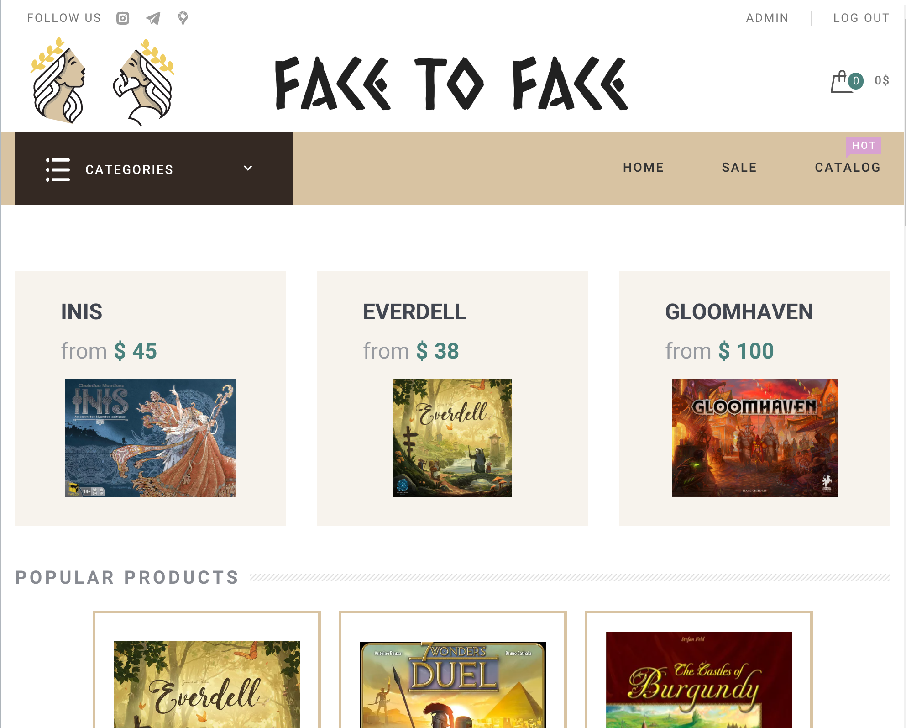
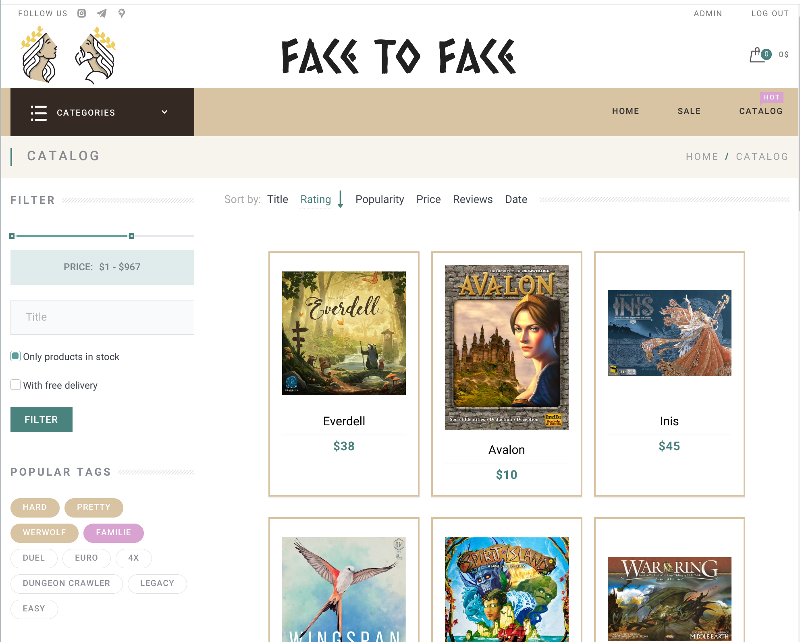
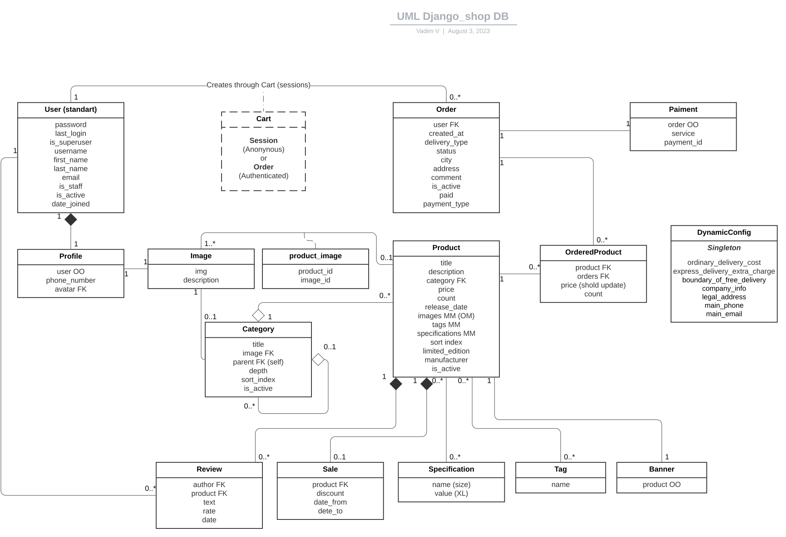

# bg_shop_django

## Technologies used
- 
- 
- 
- 
- 
- 
- 

## Installation
- Install docker 
   - Start docker
- Install git
- Git clone
- Configure `.env` using `.env.template`
- Configure `config/nginx` if needed.
- `docker compose up --build`
- `docker compose exec app bash scripts/init_load_data.sh` 
to load init demo db data from fixtures

Script fills db with initial demo data, and it creates
superuser with unsafe password (! do not run script in
production !). Demo images are stored in `static/` so it 
can cause unexpected troubles with deleting or updating.

It is advisable to upload new images using admin panel for
each Image object, and change superuser password.

## Description

This is an online store for a seller of board games.

The main element is products, in the form of cards that 
link to detailed pages with product descriptions.

On the main page there are banners of products created by 
the administrator, popular products, limited goods.

The catalog section contains all products, with the 
possibility of filtering and searching, divided into pages.

In the Discounts section, the current discounts are 
indicated, only one, the largest, applies to the product.

On the detailed product page, there are several photos, 
the price including discounts, and reviews with the 
opportunity to leave your own.

There is a possibility of registration on the site. 
This makes it possible to place orders, leave feedback 
and see the order history.

The basket of goods is valid even for unauthorized users, 
when registering, goods from it are transferred to the 
user's basket.

You can place an order from the shopping cart by filling 
in the information fields and confirming.

The completed order can be paid using a third-party payment 
service. At the moment, this feature is not implemented, 
instead there is an imitation of the payment service, 
which fundamentally works in the same way.

The site has an administrative section for content management.

### Features

- Personal account.
- The cart is saved between sessions, when logged in, 
the goods are added to the user cart.
- Dynamic settings allow to customize the behavior 
of the site without changing the source code, stored in 
the database, and changed in the admin panel.
- Ordering.
- A system for calculating the cost of goods, taking into account 
discounts and the type of delivery.
- Order History. With the possibility to return to the 
checkout or pay for it later.
- Imitation of a payment service using Celery.
If the "card number" ends with an even number, 
then the order is confirmed, otherwise it is rejected.
- Pagination.
- Searching, Sorting and Filtering products.
- Сustomizable Categories with Subcategories.
- Admin panel.

## DB structure

## Roadmap

### Back-end
- Cache
- Real payment service
- Registration by email

### Front-end
- Display errors connected with fields next to them
- Input masks
- Displaying avatar in reviews.
- Displaying product specifications. 

## License

## Project status
In progress
